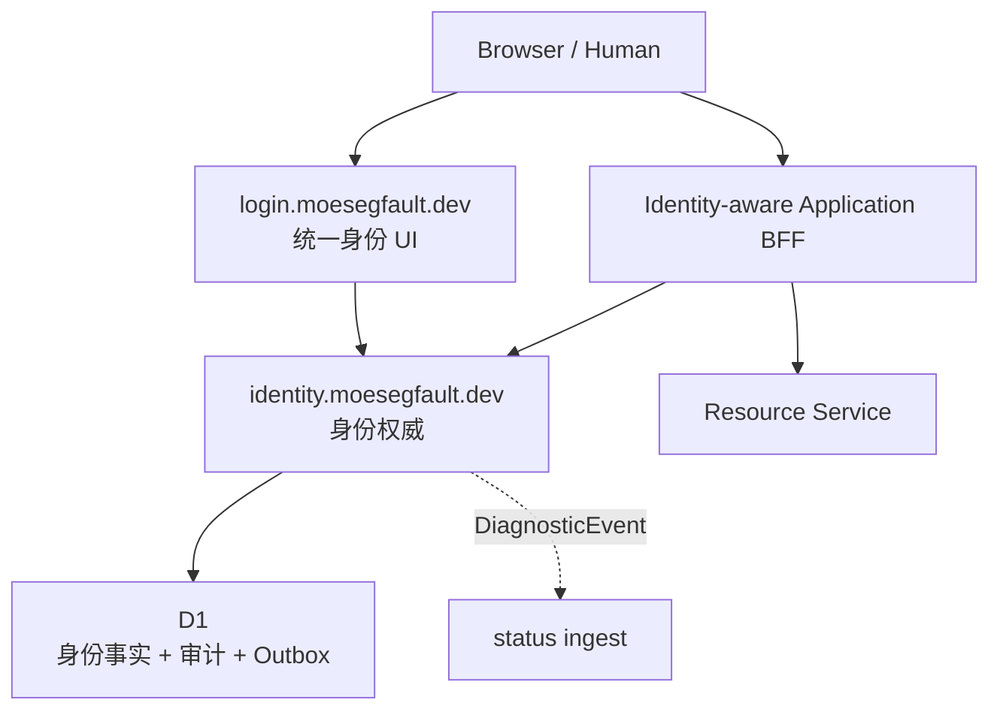
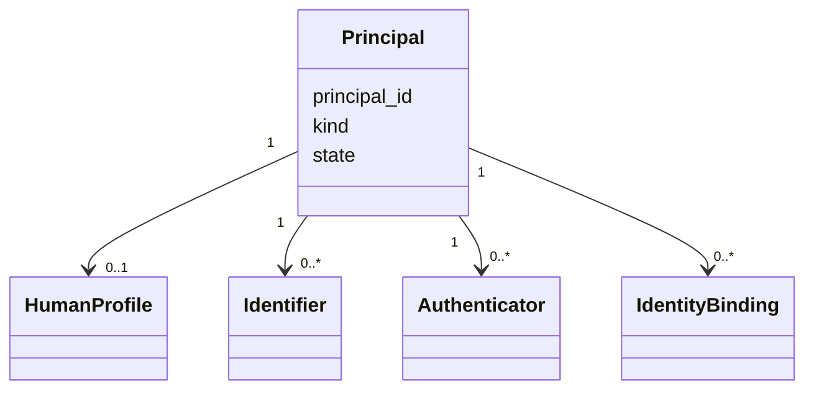
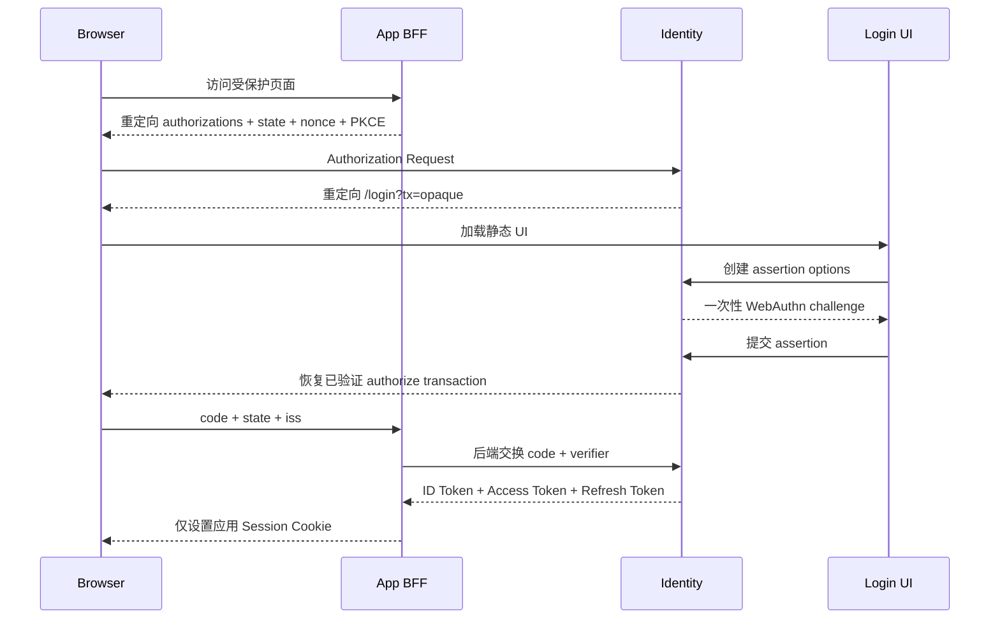

# moeSegFault Login 与 Identity 设计

## 1. 文档地位

本文定义 `login.moesegfault.dev` 与 `identity.moesegfault.dev` 的职责边界、领域模型、认证流程、协议表面、安全不变量、数据一致性及可观测性接入契约。

本文使用“必须”“不得”“可以”表达规范强度，其语义遵循 BCP 14。HTTP 的机器可读契约必须使用 OpenAPI 3.1.1；OpenAPI 是路径、字段、状态码、认证要求和重放语义的唯一事实来源，本文负责定义跨接口语义与系统不变量。

本文与下列平台文档共同生效：

- `observability-standard.md`：全平台可观测性契约；
- `integration-guide.md`：`status` 的公开读取、机器写入、管理员 RPC 与诊断接入边界。

本文不设计或接管 `ops` 的管理员登录。`ops` 继续使用唯一管理员密钥直接认证；`login` 与 `identity` 不替换、不代理也不降级该路径。`status` 的公开读取、机器 JWT（JSON Web Token）、管理员密钥与私有 Service Binding 契约均不因此改变。

本文不引入邮件或短信基础设施。首期注册、登录与账号恢复均不得依赖邮件发送、短信发送或人工客服；Email 只有在未来出现真实通知需求时，才可以作为可选 Binding 单独设计。

## 2. 设计结论

平台采用两个仓库、两个部署单元、一个身份权威：

| 组件 | 本质 | 拥有的职责 | 明确不拥有 |
| --- | --- | --- | --- |
| `moesegfault-login` / `login.moesegfault.dev` | 统一身份交互界面 | 注册、登录、恢复、Passkey、Bindings、会话和账号资料的 UI | 数据库、凭证验证、会话事实、OAuth/OIDC 协议状态 |
| `moesegfault-identity` / `identity.moesegfault.dev` | 身份权威（Identity Authority） | Principal、Identifier、Authenticator、Binding、Identity Session、恢复、OAuth/OIDC、审计与签名密钥 | 业务资源权限、`status` 原始遥测、业务资料 |
| 各业务服务及其 BFF | OAuth Client 与资源服务器（Resource Server） | 本地应用会话、资源权限和业务数据 | 用户凭证、统一登录 UI、全局角色 |

因此：

```text
login = presentation
identity = domain + protocol + authority
```

`login` 可以是静态 Web App，但它不是无状态认证服务。所有安全状态由 `identity` 创建、验证和消费；`login` 只持有当前页面生命周期内的短期、不透明事务句柄。

## 3. 系统边界与信任拓扑



边界不变量如下：

1. `login` 不得连接 D1，不得签发或验证 Token，不得决定账号或 Binding 是否存在。
2. `identity` 是账号、认证器、Bindings、身份会话与 OIDC Issuer 的唯一事实来源。
3. 浏览器应用必须采用前端专属后端（Backend for Frontend, BFF）；Access Token 和 Refresh Token 不得进入浏览器 JavaScript、`localStorage`、`sessionStorage` 或 IndexedDB。
4. `identity` 只证明主体及认证上下文。资源权限由资源服务器决定；不得在 Principal 上放置平台级 `is_admin`。
5. `status` 不得成为认证依赖。`status`、遥测后端或通知通道故障时，登录仍必须完成。
6. Cloudflare Service Binding 是运行时传输边界，Identity Binding 是领域关系；二者不得共用类型或命名。
7. Email、username、GitHub username、Passkey credential ID 都不是身份主键。身份主键只能是内部、不透明的 `principal_id`。
8. `ops` 不属于统一账号体系的消费者；Identity 故障不得影响管理员使用既有唯一密钥进入 `ops`。
9. Email 和 SMS 不得进入首期认证或恢复的依赖图。

## 4. 领域模型

### 4.1 Principal

主体（Principal）表示能够成为行为归属者的稳定身份：



`principal_id` 必须是无业务语义的随机 UUIDv4。OIDC `sub` 不得直接暴露 `principal_id`，而应按 client sector 派生稳定的成对主体标识（Pairwise Subject Identifier），防止不同应用无必要地关联同一人。

`Principal.state` 取：

- `active`：可认证；
- `suspended`：不可新建会话，已有会话全部撤销；
- `pending_deletion`：已停止使用，等待删除策略执行；
- `deleted`：身份不可恢复，保留最小冲突墓碑和审计引用。

`Principal.kind` 取 `human` 或 `workload`。`login` 只处理 `human`。工作负载主体（Workload Principal）只能通过机器协议认证，不得伪装成人类账号；现有 `status` 机器 JWT 在资源服务器显式加入新的 Issuer 前继续按原契约工作。

### 4.2 Identifier

标识符（Identifier）是可展示或可查找的名称，不是认证凭证：

| 类型 | 语义 | 约束 |
| --- | --- | --- |
| `username` | 平台可读 handle | ASCII 小写规范化后唯一；展示名不受此限制 |

首期只实现 `username`。不采集“以后可能会用”的 Email，避免由此引入验证邮件、发送域名、退信处理、投递监控、滥用控制和隐私保留成本。未来如有真实通知需求，Email 必须作为可选 Binding 增量加入，且不得自动获得登录或恢复能力。

### 4.3 Authenticator

认证器（Authenticator）回答“主体如何证明对身份的控制”。人类主体的第一等认证器是 WebAuthn Passkey；平台不实现密码数据库。

每个 Passkey 必须独立建模并保存：

| 字段 | 语义 |
| --- | --- |
| `authenticator_id` | UUIDv7，不透明管理 ID |
| `principal_id` | 所属主体 |
| `credential_id` | WebAuthn credential ID，全局唯一 |
| `public_key` | 规范编码后的 credential public key |
| `sign_count` | 最近观察到的签名计数；不得仅因同步 Passkey 未递增便拒绝认证 |
| `aaguid` | Authenticator Attestation GUID |
| `transports` | 注册时返回的 transport 集合，未知值必须保留 |
| `backup_eligible` / `backup_state` | WebAuthn BE / BS 状态 |
| `label` | 用户可修改的设备说明 |
| `created_at` / `last_used_at` / `revoked_at` | 生命周期 |

WebAuthn 固定策略：

- `rp.id = login.moesegfault.dev`；不得设为整个 `moesegfault.dev`；
- expected origin 只允许 `https://login.moesegfault.dev`，开发环境仅允许显式登记的 `http://localhost:<port>`；
- `residentKey = required`，使用可发现凭证（Discoverable Credential）；
- `userVerification = required`；
- 默认 `attestation = none`，不以厂商认证构造虚假硬件保证；
- challenge 必须高熵、一次性、短期有效，并绑定事务、浏览器和预期用途；
- 注册、认证、增加与撤销 Passkey 必须分别使用不同事务类型；
- 新增或撤销 Authenticator 必须要求近期 Passkey 认证，并写安全审计事件。

WebAuthn Level 3 明确规定 RP ID 决定凭证可使用的 origin 范围，因此把 RP ID 收窄到 `login.moesegfault.dev` 是子域隔离的一部分，而不是展示层细节。

### 4.4 Identity Binding

身份绑定（Identity Binding）表示一个外部命名空间中的稳定主体与内部 Principal 的关系：

\[
(issuer, subject) \longrightarrow principal
\]

Binding 不是 Authenticator。某些 Binding 可以参与联合认证（Federated Authentication），但数据库仍必须区分“外部主体映射”和“本地凭证”。

Binding 分为：

| 类型 | 例子 | 核心键 |
| --- | --- | --- |
| `federated_human` | GitHub、Google 或其他 OIDC/OAuth 身份 | `(issuer, subject)` |
| `workload` | GitHub Actions OIDC、CI deployment identity | `(issuer, subject, claim_policy_revision)` |

核心不变量：

1. `(issuer, subject)` 必须全局唯一地映射到一个 Principal。
2. 外部用户名、邮箱、头像和 provider access token 都不得作为 Binding 主键。
3. 不得依据“provider 返回了相同 email”自动合并或绑定账号。
4. 新建 Binding 必须从已认证的本地会话发起，经过近期 Passkey 认证，并把 provider callback 绑定到一次性 `binding_transaction`。
5. 外部 provider 的 `state`、PKCE verifier、issuer、redirect URI 和 subject 必须全部验证；只拿到 email 不构成成功。
6. Identity 只需登录时取得 subject 时，不得持久保存 provider access token。业务确需长期调用 provider API 时，应由对应业务服务另建授权关系。
7. 解除 Binding 前必须确认主体仍有至少一个可用 Passkey；不得用“删掉最后一种入口”制造锁死状态。
8. Binding 冲突返回稳定的 `409 binding_conflict`，不得自动迁移、覆盖或合并 Principal。

账号合并不是 Binding 的隐式副作用。平台没有可信、可逆且普适的自动合并规则，因此不得提供自动 merge；需要合并时必须作为独立、人工确认且完整审计的领域操作设计。

### 4.5 Session 与认证上下文

必须区分两类会话：

| 会话 | 所有者 | 浏览器凭据 | 用途 |
| --- | --- | --- | --- |
| Identity SSO Session | `identity` | `identity.moesegfault.dev` 的 host-only Cookie | 记住统一认证与近期认证时间 |
| Application Session | 各应用 BFF | 各应用自己的 host-only Cookie | 保存该应用的 OAuth Token 与本地授权上下文 |

Identity Session 至少记录 `authenticated_at`、`last_seen_at`、`expires_at`、`authenticator_id`、认证方法参考（Authentication Method Reference, `amr`）、认证上下文（Authentication Context Class Reference, `acr`）和撤销状态。

基线时限：

| 对象 | 时限与规则 |
| --- | --- |
| Identity Session | 12 小时空闲过期、30 天绝对过期 |
| 近期认证 | 高风险操作前 5 分钟内完成 Passkey UV |
| WebAuthn / Binding transaction | 5 分钟；只能消费一次 |
| Authorization Code | 60 秒；只能消费一次；绑定 client、redirect URI 和 PKCE challenge |
| ID Token / Access Token | 最长 5 分钟 |
| Refresh Token | 30 天绝对期限；每次使用轮换；检测重用后撤销整个 token family |

这些时限是服务端策略，不写死在客户端。收紧新建会话的策略不应破坏已签发对象的原始 `expires_at` 语义；紧急处置使用显式撤销。

外部 Binding 只有在其记录与 provider policy 都显式标记 `authentication_enabled` 时才能参与登录。此类登录建立较低认证上下文；增加或撤销 Authenticator、管理 Binding 与恢复材料时仍必须用 Passkey 完成 step-up。启用外部登录等于扩大账号的有效登录边界，UI 必须明确展示这一事实。

## 5. Login 前端设计

### 5.1 路由

`login` 提供下列人类界面：

| 路由 | 用途 |
| --- | --- |
| `/register` | 创建 Principal、注册第一个 Passkey、生成恢复材料 |
| `/login` | Passkey 登录并恢复待完成的 OIDC transaction |
| `/recovery` | 使用一次性恢复凭证重新建立控制权 |
| `/account` | 资料与安全概览 |
| `/account/passkeys` | 列出、命名、增加和撤销 Passkey |
| `/account/bindings` | 列出、建立和解除外部 Binding |
| `/account/sessions` | 查看并撤销 Identity Session |
| `/account/recovery` | 重新生成恢复代码 |

UI 必须把每个 Passkey 显示为独立实体，至少展示 label、创建时间、最近使用时间、同步状态及是否建立当前会话。安全操作完成后必须展示实际效果，而不是只显示“成功”toast。

### 5.2 浏览器存储与供应链

`login` 必须满足：

- 不在 `localStorage`、`sessionStorage`、IndexedDB、URL fragment 或 Service Worker cache 保存 Token、Session、WebAuthn challenge、recovery code、provider token 或长期事务状态；
- 不加载第三方脚本、统计 SDK、广告、远程字体或 tag manager；
- HTML 使用 `Cache-Control: no-store`，带内容哈希的静态资产可以长期 immutable cache；
- 默认不注册 Service Worker，避免旧认证代码和敏感响应被离线缓存；
- 页面收到 `tx` 后立即读入内存并使用 `history.replaceState` 清理地址栏；事务句柄不是 bearer credential，但仍不得进入 Referer；
- 所有用户可见安全状态直接从 `identity` 读取，不靠前端推断。

### 5.3 安全响应头

无论静态文件托管在 Workers Static Assets、Pages 还是 GitHub Pages，最终响应都必须具备可验证的安全头。托管平台不能直接设置时，必须由 Cloudflare 响应头规则补齐：

```http
Content-Security-Policy: default-src 'none'; script-src 'self'; style-src 'self'; img-src 'self' data:; connect-src https://identity.moesegfault.dev; base-uri 'none'; object-src 'none'; frame-ancestors 'none'; form-action 'self'
Referrer-Policy: no-referrer
X-Content-Type-Options: nosniff
Cross-Origin-Opener-Policy: same-origin
Permissions-Policy: publickey-credentials-get=(self), publickey-credentials-create=(self)
```

不得以放宽 `script-src` 到 `'unsafe-inline'` 或任意 CDN 来修复构建问题。

## 6. 浏览器边界：Cookie、CORS 与 CSRF

Identity Session Cookie 使用：

```http
Set-Cookie: __Host-identity_session=<opaque>; Secure; HttpOnly; SameSite=Lax; Path=/
```

不得设置 `Domain`。服务端只保存 256-bit 随机 session secret 的摘要；认证成功、权限提升和恢复完成后必须轮换 session secret，防止会话固定（Session Fixation）。

这里使用 `SameSite=Lax` 而不是 `Strict`，是为了允许来自不同站点的 OIDC client 通过顶层安全导航进入 `/v1/oauth/authorizations` 时携带 SSO Cookie。各应用 BFF 的本地 Session Cookie 没有这一需求，应使用 `Secure; HttpOnly; SameSite=Strict; Path=/` 且不设置 `Domain`。

`login` 与 `identity` 是同站但跨源。SameSite 不能抵御被攻破的兄弟子域，因此所有浏览器状态变更接口还必须同时满足：

1. `Origin` 精确等于 `https://login.moesegfault.dev`，拒绝缺失、`null` 或其他 Origin；
2. CORS 只允许该 origin，`Access-Control-Allow-Credentials: true`，不得使用 `*`；
3. 只接受 `application/json`，并要求自定义 `x-moesegfault-csrf` header 触发预检；
4. CSRF token 必须绑定 Identity Session 或 authentication transaction，并以常量时间验证；
5. Fetch Metadata 不符合预期时拒绝，不能把它当唯一防线；
6. `/v1/oauth/authorizations` 只接受浏览器导航，不开放 CORS；discovery 与 JWKS 可以公开跨源 GET 且不携带凭据。

## 7. 核心流程

### 7.1 注册

注册不是“写入一行 user”，而是一笔原子领域操作：

\[
CreatePrincipal + CreateProfile + RegisterAuthenticator + AppendAudit
\]

流程如下：

1. `login` 请求创建 `registration_transaction`；`identity` 根据注册策略和滥用控制返回 WebAuthn creation options。
2. 浏览器在 `login.moesegfault.dev` 调用 `navigator.credentials.create()`。
3. `login` 把 attestation response 原样提交给 `identity`，不得在前端自行判断可信性。
4. `identity` 验证 type、challenge、origin、RP ID hash、UV flag、算法、credential ID 唯一性和事务绑定。
5. D1 在一个事务中创建 Principal、profile、Authenticator、Identity Session、安全审计与 Outbox 记录。
6. `identity` 轮换 Session Cookie；`login` 引导用户下载恢复代码并明确提示再注册一个独立 Passkey。

账号必须始终至少保留一个有效 Passkey；注册完成页应提示用户增加第二个独立 Passkey，并下载一次性恢复代码。

注册策略取 `closed`、`invite_only` 或 `open`，默认 `invite_only`。邀请是一次性、短期、只保存摘要的 registration capability；它只允许开始注册，不预先决定 Principal ID 或资源权限。`open` 模式必须启用分层速率限制和风险触发的人机校验，但人机校验失败不得被伪装成凭证失败。

### 7.2 OIDC 登录



细则：

- `identity` 必须在创建登录事务前完成 `client_id`、response type、scope、redirect URI 与 PKCE 参数验证；无效请求不得进入 `login`。
- 原始 Authorization Request 保存在服务端，`login` 只看到 client 展示信息与不透明 transaction ID。
- Passkey assertion 成功后，必须先原子消费 authentication transaction，再创建或轮换 Identity Session。
- Authorization Code 必须保存摘要并通过条件更新一次消费；重复兑换统一失败。
- BFF 必须验证 `state`、authorization response `iss`、ID Token 的 `iss`、`aud`、`exp`、`iat`、`nonce` 和签名。
- 浏览器永远不接触 Token；BFF 通过自己的 host-only Session Cookie 暴露应用 API。

Passkey 登录默认使用空 `allowCredentials` 的可发现凭证流程：客户端不先提交 username 或 email，`identity` 在验证 assertion 后依据 credential ID 与 user handle 解析 Principal。这既减少账号枚举，也让 username 彻底退出认证正确性路径。

启用外部 Binding 登录时，authentication transaction 必须先记录允许的 provider 与预期认证上下文，再进行 provider authorization。Callback 验证成功后只能按 `(issuer, subject)` 查找既有 Binding；未绑定 subject 不得因相同 email 自动注册、自动绑定或登录。外部登录不能用于恢复、替换或撤销 Passkey。

### 7.3 增加与撤销 Passkey

增加 Passkey：近期 Passkey 认证 → 新 registration transaction → WebAuthn create → 原子写 Authenticator、audit、outbox。

撤销 Passkey：近期 Passkey 认证 → 展示将撤销的具体设备 → 原子写 `revoked_at`、撤销由该 Authenticator 建立且风险相关的 Identity Sessions、写 audit 与 outbox。

不得撤销主体最后一个有效 Passkey，除非同一事务正在完成账号删除。恢复代码不是长期替代 Authenticator。

### 7.4 建立与解除 Binding

建立 Binding：

1. 已认证账号发起 `binding_transaction`；
2. `identity` 要求 5 分钟内的 Passkey step-up；
3. `identity` 生成 provider `state` 与 PKCE，服务端保存摘要；
4. provider callback 只进入 `identity`，验证 issuer、state、PKCE、redirect URI 与 subject；
5. D1 使用 `UNIQUE(issuer, subject)` 原子创建 Binding、audit、outbox；
6. 浏览器只被重定向到事务记录中的固定 `login` 完成页，不接受任意 return URL。

解除 Binding 同样要求近期 Passkey 认证。若该 Binding 曾建立当前或其他活跃会话，解除时必须撤销这些会话；不得只删除 UI 行而保留认证能力。

### 7.5 恢复

恢复不需要邮件服务、短信服务或人工审核。恢复能力只来自用户在注册时已经取得的材料：其他有效 Passkey，或一次性恢复代码。恢复代码必须是至少 128-bit 熵的一次性随机秘密，采用带公开 ID 前缀的格式；D1 只保存以独立 secret pepper 计算的 HMAC-SHA-256 摘要。

恢复完成必须在一个事务中：

1. 消费恢复代码；
2. 撤销全部 Identity Sessions、Authorization Codes 和 Refresh Token families；
3. 把账号置为 `recovery_required` 限制态；
4. 建立仅能访问 Passkey 注册接口的短期恢复会话；
5. 注册新 Passkey 后解除限制；
6. 写入高优先级安全审计，并由 Outbox 产生安全 Diagnostic。

若全部 Passkey 与恢复代码均丢失，账号即不可恢复。平台不得通过管理员密钥、Email、人工判断或修改数据库绕过认证；`ops` 的管理员密钥只管理 `ops`，不是普通账号的万能恢复器。

### 7.6 登出与撤销

- 本应用登出：BFF 撤销自身 Refresh Token family 并清除应用 Cookie；
- Identity 单点登出：撤销当前 Identity Session；
- 全部设备登出：撤销该 Principal 的全部 Identity Sessions 与 Refresh Token families；
- Principal suspend / delete：同一事务撤销所有认证能力和未完成 transaction。

OIDC RP-Initiated Logout 的 `post_logout_redirect_uri` 必须按 client 精确登记，禁止任意重定向。

## 8. OAuth / OIDC 协议

`identity.moesegfault.dev` 是唯一 Issuer：

```text
https://identity.moesegfault.dev
```

协议表面：

| 方法与路径 | 用途 |
| --- | --- |
| `GET /.well-known/openid-configuration` | OIDC Discovery |
| `GET /.well-known/jwks.json` | 当前与仍需验证历史 Token 的公钥 |
| `GET /v1/oauth/authorizations` | Authorization Endpoint；仅导航，不开放 CORS |
| `POST /v1/oauth/tokens` | Authorization Code exchange 与 refresh rotation |
| `POST /v1/oauth/revocations` | Token revocation |
| `GET /v1/oidc/user-claims` | UserInfo Endpoint；返回最小 claims |
| `GET|POST /v1/oidc/logout-requests` | RP-Initiated Logout |

只允许 Authorization Code Flow + PKCE `S256`。明确禁止 Implicit Grant、Resource Owner Password Credentials Grant、wildcard redirect URI 和公开动态客户端注册。

所有 redirect URI 使用精确字符串匹配；native CLI 只允许预登记的 loopback redirect 规则。Confidential client 优先使用 `private_key_jwt`，不得把共享 client secret 放进前端仓库。

Token 约束：

- ID Token 使用 RS256，并至少包含 `iss`、pairwise `sub`、`aud`、`iat`、`exp`、`auth_time`、`nonce`、`amr`、`acr`；
- Access Token 必须限制 `aud` 与最小 scope，资源服务器必须同时验证二者；
- claims 不得包含 roles、完整 profile、Bindings、邮箱之外的隐私资料或业务权限；
- Refresh Token 只发给能安全保存它的 BFF / native client，数据库只保存摘要；
- `kid` 必须存在，客户端只能从固定 Issuer 的 JWKS 验证，不得根据 Token 内任意 URL 取钥；
- Identity 的签名钥不得与 `status` release JWT、Cloudflare API Token 或任何外部 provider secret 复用。

签名密钥轮换顺序固定为：发布新公钥 → 部署新私钥 → 切换 active `kid` → 等待旧 Token 最大寿命与时钟容差 → 停止签名 → 最后移除旧公钥。紧急泄漏时允许立即撤销，并以显式安全事件承担兼容性中断。

## 9. Identity HTTP API 资源

业务 API 使用复数名词、`/v1` major 前缀、`snake_case` JSON 和 RFC 9457 Problem Details。建议资源面如下，具体 schema 由 OpenAPI 固化：

| 资源 | 操作 |
| --- | --- |
| `/v1/registration-transactions` | 创建注册事务、提交 attestation |
| `/v1/authentication-transactions` | 创建认证事务、提交 assertion |
| `/v1/recovery-transactions` | 创建并消费恢复事务 |
| `/v1/principals/self` | 读取与修改自身 profile |
| `/v1/principals/self/identifiers` | 管理 username |
| `/v1/principals/self/authenticators` | 列出、增加、撤销 Passkey |
| `/v1/principals/self/bindings` | 列出与解除 Binding |
| `/v1/binding-transactions` | 发起、完成外部 Binding |
| `/v1/principals/self/sessions` | 列出与撤销 Identity Session |
| `/v1/principals/self/recovery-codes` | 重新生成并一次展示恢复代码 |

所有 transaction 的完成接口必须采用条件写实现一次消费；客户端重复提交相同幂等请求时，返回原结果或确定的冲突，不得创建第二个 Principal、Binding、Authenticator 或 Session。

标准 Problem type 至少包括：

- `invalid_transaction`、`transaction_expired`、`transaction_consumed`；
- `reauthentication_required`；
- `binding_conflict`、`identifier_conflict`；
- `last_authenticator`；
- `invalid_redirect_uri`、`invalid_client`、`invalid_scope`；
- `registration_disabled`、`principal_suspended`；
- `rate_limited`。

对未认证调用，错误正文不得泄露 username、credential ID 或 Binding 是否存在。所有响应必须返回由公网入口生成的 `x-moesegfault-correlation-id`；不得信任公网请求传入的同名 header。

## 10. D1 数据模型与一致性

Identity 的关系型事实保存在独立 D1 database。逻辑表如下：

| 表 | 关键字段 / 约束 |
| --- | --- |
| `principal` | `principal_id PK`、`kind`、`state`、timestamps |
| `human_profile` | `principal_id PK/FK`、display name、avatar、locale |
| `identifier` | `identifier_id PK`、`principal_id FK`、kind、value、normalized value；按 kind 建唯一索引；首期 kind 仅为 `username` |
| `authenticator` | `authenticator_id PK`、`principal_id FK`、`credential_id UNIQUE`、public key、WebAuthn 状态、revoked_at |
| `identity_binding` | `binding_id PK`、`principal_id FK`、issuer、subject、kind、metadata allowlist；`UNIQUE(issuer, subject)` |
| `identity_session` | session digest、principal、authenticator、auth times、expiry、revoked_at |
| `auth_transaction` | kind、challenge digest、browser binding digest、state、expiry、consumed_at |
| `binding_transaction` | provider、state digest、PKCE digest、principal、expiry、consumed_at |
| `recovery_code` | public code ID、secret digest、principal、used_at |
| `oauth_client` | client ID、type、sector、redirect URIs、allowed scopes、state |
| `authorization_code` | code digest、client、principal、redirect URI、PKCE challenge、expiry、consumed_at |
| `refresh_token_family` | family、client、principal、current token digest、expiry、revoked_at、reuse_detected_at |
| `signing_key` | `kid`、algorithm、public JWK、state、activation / retirement time；不保存私钥 |
| `security_audit_event` | 不可变安全事实 |
| `diagnostic_outbox` | 待投递到 `status` 的持久事件与投递状态 |
| `idempotency_record` | caller、operation、key、request digest、result reference、expiry |

所有会话、code、refresh token、recovery secret 和 provider state 只保存摘要；私钥和 peppers 放入独立 Workers Secrets，并按用途隔离。

下列变更必须与安全审计、必要的 Outbox 写入位于同一 D1 transaction：

- Principal 创建、暂停、恢复和删除；
- Authenticator 创建、撤销；
- Binding 创建、撤销；
- Session 创建、轮换、撤销；
- recovery code 消费；
- Authorization Code 与 Refresh Token 的消费或重用处置；
- OAuth client 与 signing key 状态变化。

D1 `batch()` 提供整批 SQL transaction，任一语句失败时回滚整批，适合实现上述原子变更。启用 read replication 后，认证正确性路径必须使用 `withSession("first-primary")` 或从已知 bookmark 继续，保证当前逻辑链的顺序一致性（Sequential Consistency）。

KV 不得承载 credential、challenge、session、撤销、authorization code、refresh token、Binding 唯一性或幂等权威状态。它只能缓存公开 discovery、JWKS 或非安全展示数据；缓存 miss 与过期不得改变认证结果。

## 11. 授权边界

Identity 只做两类运行时授权：

1. 主体能否管理自己的 Identifier、Authenticator、Binding 和 Session；
2. OAuth client 能请求哪些 redirect URI、audience 与 scope；

OAuth client、注册策略和签名密钥属于部署配置，不通过普通账号、`login` UI 或 Identity Token 管理。业务角色属于各资源；不得把资源权限塞入 ID Token。若多个资源以后共享策略，应显式建立独立授权域，而不是让认证数据库演变成全平台权限垃圾场。

## 12. 安全审计与可观测性

### 12.1 三种数据不可混同

| 数据 | 权威位置 | 是否可含 Principal ID | 是否进入 `status` |
| --- | --- | --- | --- |
| Security Audit | Identity D1 | 可以，受限访问 | 不作为原始审计仓库 |
| Trace / Log / Metric | 遥测后端 | 默认不得；仅用非识别分类属性 | 只保存引用或评估结果 |
| DiagnosticEvent | `status` | 不得携带账号隐私 | 是 |

每次登录失败都写 security audit，但普通失败不是 Diagnostic。只有影响服务能力、安全态势或运维动作的聚合事实才进入 `status`。

### 12.2 Security Audit 事件

事件名遵循 `<domain>.<entity>.<past-tense-action>`：

```text
identity.registration.completed
identity.authentication.succeeded
identity.authentication.failed
identity.authenticator.created
identity.authenticator.revoked
identity.binding.created
identity.binding.revoked
identity.session.created
identity.session.revoked
identity.recovery.started
identity.recovery.completed
identity.recovery.failed
identity.principal.suspended
identity.principal.deleted
identity.oauth_client.changed
identity.signing_key.activated
identity.signing_key.retired
```

Audit 至少记录：`audit_event_id`、event name、occurred / observed time、actor principal、subject principal、client ID、outcome、reason code、authenticator reference、correlation ID、trace ID 和 policy revision。不得记录 challenge、assertion、attestation 原文、Cookie、Token、recovery secret、provider token 或请求正文。

IP 与 User-Agent 属于受限安全数据，不进入普通 telemetry；确需调查时应进入单独、短保留期的 audit context，并采用字段 allowlist 与权限隔离。

### 12.3 Trace、Log 与 Metric

稳定 Span 名称包括：

```text
identity.oauth.authorize
identity.authentication.verify
identity.registration.verify
identity.binding.establish
identity.session.create
identity.token.exchange
identity.recovery.consume
```

Span 名不得包含 Principal、username、credential ID、provider subject 或 transaction ID。Correlation ID、trace context、service/deployment identity 必须按 `observability-standard.md` 传播。

低基数指标至少包括：

- `identity.authentication.attempts` Counter：labels 仅含 `method`、`outcome`、稳定 `error.type`；
- `identity.authentication.duration` Histogram；
- `identity.oauth.token_exchanges` Counter；
- `identity.external_provider.duration` Histogram：provider 必须来自有限 registry；
- `identity.outbox.pending` UpDownCounter；
- `identity.outbox.delivery_failures` Counter；
- `identity.d1.operation.duration` Histogram。

Principal ID、Correlation ID、Trace ID、username、credential ID 和自由文本不得成为 metric label。

### 12.4 Diagnostic 与 Outbox

适合产生 Diagnostic 的事实包括：

- 认证成功率或服务端验证错误率持续越过带 revision 的阈值；
- D1 写入、签名、JWKS 发布或密钥轮换失败；
- 外部身份 provider 故障达到登录能力影响阈值；
- recovery abuse、Binding takeover 或 Refresh Token reuse 出现可信安全信号；
- Diagnostic Outbox backlog 超过 freshness deadline。

单个用户输错、取消 WebAuthn、正常 401 / 403、过期 transaction 和被正确拒绝的攻击不得自动形成 Incident。

Identity 的领域写入与 `diagnostic_outbox` append 必须原子提交；异步 drain 使用既有 `status` Diagnostic ingest 契约：

- 注册真实 `service_name=identity`、environment 与 deployment；
- 使用最长 900 秒、`aud=moesegfault-status`、`diagnostics:write` 的受控机器 JWT；
- 必须按 `integration-guide.md` 建立独立的受控签发/刷新流程，不得把现有 `MACHINE_JWT_PRIVATE_KEY` 复制到 Identity；
- header 与正文使用相同 UUIDv7 Correlation ID；
- 重试保持同一 `event_id` 和正文；
- 只有匹配的 `202 accepted=true` 表示 Queue 接受；
- `status` 不可用时保留 Outbox 并有限退避，绝不阻塞认证请求。

## 13. Bootstrap 与管理面

系统没有“第一个用户自动成为管理员”的分支，也没有运行时 Identity operator 账号。

首个普通账号通过一次性、短期、只保存摘要的 registration capability 注册；它只允许完成一次普通注册，不授予任何业务权限。OAuth client、注册策略和 signing key 使用部署配置与 Workers Secrets 管理，不进入 `login` 的账号平面。配置变更经现有部署流程和安全审计生效；redirect URI 仍必须精确登记，禁止 wildcard。

`ops` 的唯一管理员密钥保持独立，不是上述 registration capability，不进入 Identity 数据库，也不能用于恢复普通账号。

## 14. 灾备、恢复与安全回滚

Identity 是平台信任根，数据库恢复不能按普通业务库处理。把 D1 恢复到旧时间点可能复活已经撤销的 Session、Binding 或 Authenticator，因此旧快照不得直接接入生产流量。

必须具备：

- D1 Time Travel / backup 与定期恢复演练；
- `security_audit_event` 经独立 Outbox 归档到不可覆盖的 R2 对象键，按 `audit_event_id` 幂等写入；
- 每次恢复先进入 `recovery_lockdown`，禁止签发新 Session 和 Token；
- 从恢复点后的独立审计归档重放撤销、删除、Binding 与 Authenticator 变更；
- 上线前轮换 session digest pepper、Refresh Token pepper 与 signing key，从而使恢复前的 Cookie 和 Token family 全部失效；
- 无法证明审计缺口已经闭合时，所有受影响 Principal 保持 suspended，重新验证并登记 Authenticator 后才能恢复。

恢复演练必须验证“已撤销凭证不会因回滚重新有效”，而不只是验证数据库能够查询。

## 15. 威胁模型与处置

| 风险 | 必需处置 |
| --- | --- |
| `login` XSS | 无第三方脚本、严格 CSP、Token 不进浏览器；任何高风险操作仍需 WebAuthn UV |
| 恶意兄弟子域 | RP ID 收窄、host-only Cookie、精确 Origin、CSRF token、CORS allowlist |
| Session fixation | 登录、step-up、recovery 后轮换随机 session secret；客户端提供的 session ID 永不采用 |
| OAuth code injection / CSRF | PKCE S256、state、nonce、response `iss`、transaction binding |
| Redirect 劫持 | 静态登记与精确匹配；无 open redirect |
| Binding takeover | recent Passkey、provider state + PKCE、`(issuer, subject)` 唯一、禁止 email auto-link |
| Token replay | 短期 audience-restricted Access Token；Refresh Token rotation 与 family reuse detection |
| 账号枚举 | 未认证响应等价、稳定 problem type、速率限制不暴露存在性 |
| 恢复降级 | 高熵一次性 recovery code；无 Email、SMS、管理员密钥或人工绕过 |
| D1 复制陈旧 | 正确性路径 first-primary / bookmark；KV 不进入权威路径 |
| `status` / telemetry 故障 | Transactional Outbox、有界异步重试、登录不等待观测系统 |
| 签名钥泄漏 | 用途隔离、`kid` 轮换、紧急撤销、审计与 Diagnostic |

## 16. 合规门禁

服务只有在以下检查全部通过后才可进入 production：

| 检查 | 通过条件 |
| --- | --- |
| Boundary | `login` 无数据库与签名能力；浏览器中不存在 OAuth Token |
| WebAuthn | origin、RP ID、challenge、UV、credential uniqueness 与一次消费均有正反集成测试 |
| Subdomain Isolation | 任意兄弟子域无法发起有效 account mutation 或使用 Passkey |
| Session | fixation、过期、轮换、全局撤销和并发撤销测试通过 |
| OAuth/OIDC | 官方 conformance tests 覆盖 discovery、JWKS、code + PKCE、nonce、issuer、exact redirect |
| Binding | callback mix-up、重复 subject、email auto-link、解除最后入口均被拒绝 |
| Recovery | code 一次消费；完成后旧 session / token 全部失效；秘密不出现在 telemetry |
| Authorization | Identity Token 不含业务 roles；`ops` 不接入 Identity |
| Consistency | 领域变更、audit 与 outbox 原子；并发消费只成功一次 |
| Disaster Recovery | 回滚后旧 Session / Token 无效；已撤销 Authenticator 不会复活；审计重放完成 |
| Redaction | Cookie、Token、challenge、assertion、recovery code、provider token canary 均未导出 |
| Observability | trace / correlation / deployment 可关联；`status` 故障不阻塞登录 |
| Compatibility | `ops` 唯一管理员密钥及 `status` 现有全部契约保持不变 |
| Contract | OpenAPI lint、runtime schema、breaking-change 与未声明公网路由检查通过 |

## 17. 规范与研究依据

- [Web Authentication Level 3](https://www.w3.org/TR/webauthn-3/)：WebAuthn ceremony、RP ID、origin、credential record 与同步凭证状态；
- [OpenID Connect Core 1.0 incorporating errata set 2](https://openid.net/specs/openid-connect-core-1_0.html)：Issuer、ID Token、nonce、UserInfo 与 Authorization Code Flow；
- [RFC 9700: Best Current Practice for OAuth 2.0 Security](https://www.rfc-editor.org/rfc/rfc9700.html)：PKCE、精确 redirect URI、禁止 Password Grant、refresh rotation、audience restriction 与 mix-up 防护；
- [RFC 10017: OAuth 2.0 for Browser-Based Applications](https://www.rfc-editor.org/rfc/rfc10017.html)：BFF、浏览器 Token 隔离、host-only Cookie 与 CSRF 防护；
- [RFC 9457: Problem Details for HTTP APIs](https://www.rfc-editor.org/rfc/rfc9457.html)；
- [RFC 9562: UUIDs](https://www.rfc-editor.org/rfc/rfc9562.html)；
- [NIST SP 800-63B-4: Authentication and Authenticator Management](https://pages.nist.gov/800-63-4/sp800-63b.html)：认证器生命周期、抗钓鱼认证与恢复控制；
- [Cloudflare D1 Database API](https://developers.cloudflare.com/d1/worker-api/d1-database/) 与 [Global Read Replication](https://developers.cloudflare.com/d1/best-practices/read-replication/)：batch transaction、Sessions API 与顺序一致性；
- Jannett et al., [The State of Passkeys: Studying the Adoption and Security of Passkeys on the Web](https://www.usenix.org/conference/usenixsecurity26/presentation/jannett), USENIX Security 2026：真实部署中的 Passkey 添加、删除、session fixation 与账号接管风险；
- Daffalla et al., [Challenges Investigating and Remediating Adversarial Passkeys](https://www.usenix.org/conference/usenixsecurity26/presentation/daffalla), USENIX Security 2026：用户识别并清除恶意 Passkey 的实际困难，支持把 Authenticator 清单、来源与撤销效果做成一等 UI。
